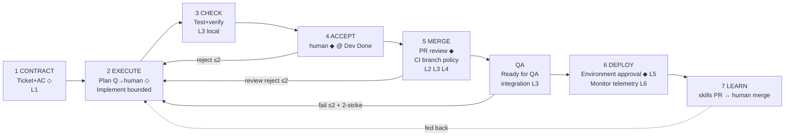

# Roadmap: Agentic SDLC Workflow (Golden Path, post-audit v2)

## Overview

Implements the **Golden Path Standard (ten steps, seven columns, L1–L6 evidence)** adapted per audit decisions: QA stage restored between Merge and Deploy; gated deploy + prod monitoring in v1 scope; existing ADO board states reused (ACCEPT gate lives on `Dev Done`); native ADO branch policies and Environments enforce CI/deploy gates — the system reads gate status, never re-implements it.

## Authoritative ADO State Matrix

| Golden Path Step | Column | ADO State | Actor | Evidence |
|---|---|---|---|---|
| 1. Ticket + AC | CONTRACT | 3/3 | Complete    | 2026-09-08 |
| — triage | CONTRACT | `Ready to Dev` → `In Dev` | human assigns domain tags | — |
| 2. Plan (Q→human) | EXECUTE | 3/3 | Complete    | 2026-09-08 |
| 3. Implement | EXECUTE | 3/3 | Complete    | 2026-09-08 |
| 4. Test + verify | CHECK | 3/3 | Complete    | 2026-09-09 |
| 5. Accept | ACCEPT | `Dev Done` | human verdict ◆ (packet: tests + diff + preview) | acceptance |
| 6. PR review | MERGE | `Dev Done` | human verdict ◆ (reject → `In Dev`, breaker ≤2) | — |
| 7. CI gates | MERGE | merge blocked until green | native branch policy (pipeline re-runs) | **L2, L3, L4** |
| QA verify | QA | merge → `Ready for QA`; fail → `In Dev` (bounce ≤2); pass → `Ready to Deploy` | tester / QA agent | **L3 integration** |
| 8. Deploy | DEPLOY | `Ready to Deploy` | human ◆ via native ADO Environment approval | **L5** |
| 9. Monitor | DEPLOY | post-deploy window (default 30 min) | pipeline reads Azure Monitor/App Insights | **L6** |
| 10. Learn | LEARN | after Done | agent extracts → PR to skills repo (human merges) | skills fed back |

Workflow **complete ("Done")** = deployed + monitor window passed + L1–L6 evidence index attached.

## Adapted Flow (differs from raw standard: +QA column, native gates)

## Phases

- [x] **Phase 1: CONTRACT — ADO Ingress, Event Gateway & L1 Contract Auditor** — Webhook HMAC verification, SQLite dedup lock, bot echo filter, requirements auditor, `New` → `Ready to Dev` transition. (completed 2026-09-08)
- [x] **Phase 2: EXECUTE Foundation — Sandbox, Dynamic MCP & Plan Checkpoint** — Ephemeral worktree manager, secret-scrubbing process runner, tag-scoped MCP dispatch, interactive plan Q→human with release/re-trigger lifecycle. (completed 2026-09-08)
- [x] **Phase 3: EXECUTE + CHECK — Bounded Implementation & Self-Repair Verification** — <250 LOC diff budget, read-only test guards, local unit test loop with self-repair, L3 evidence capture, `In Dev` → `Dev Done`. (completed 2026-09-08)
- [x] **Phase 4: ACCEPT — Human Validation Gate & Rework Breaker** — Acceptance packet assembly, verdict handling at `Dev Done`, reject → `In Dev` rework envelope, shared max-2 breaker. (completed 2026-09-09)
- [ ] **Phase 5: MERGE — PR Lifecycle & Native CI Gate Verification** — PR creation with `AB#` link, review verdict listener, branch-policy status reader (L2/L3/L4), review-reject rework loop, merge → `Ready for QA`.
- [ ] **Phase 6: QA — Verification Loop** — Integration/e2e suite runner, 2-strike flake filter, failure diagnostics → `In Dev` (bounce ≤2), pass → `Ready to Deploy`.
- [ ] **Phase 7: DEPLOY — Native Environment Approval & Telemetry Monitor** — ADO Environments approval wiring (L5), Azure Monitor/App Insights evaluation window (L6), Done marking with evidence index.
- [ ] **Phase 8: LEARN — Skills Feedback Loop** — Lifecycle analysis, pattern/postmortem extraction, PR-based skills submission (human merge).

---

## Phase Details

### Phase 1: CONTRACT — ADO Ingress, Event Gateway & L1 Contract Auditor
**Goal**: Secure webhook ingress, deduplication, loop protection, and automated L1 contract audit.
**Depends on**: Nothing
**Requirements**: INGEST-01, INGEST-02, INGEST-03, CONTR-01, CONTR-02
**Success Criteria**:
  1. Valid HMAC webhook accepted (HTTP 202); invalid rejected (HTTP 401).
  2. Duplicate `(workItemId, revId)` deliveries dropped.
  3. Bot-identity events filtered — no recursive loops.
  4. Complete AC → ticket transitions to "Ready to Dev" with L1 audit summary comment.
  5. Ambiguous ticket stays "New" with specific missing-info comment.
**Plans**: 3 plans

Plans:
- [x] 01-01-PLAN.md — Project scaffolding, SQLite WAL deduplication store, HMAC verification, bot shield, and Fastify ingress route.
- [x] 01-02-PLAN.md — Definition of Done rubric prompt, Zod audit schema, and Vercel AI SDK reasoning service.
- [x] 01-03-PLAN.md — Azure DevOps REST client with retry backoff, HTML discussion formatters, and background audit worker pipeline.

### Phase 2: EXECUTE Foundation — Sandbox, Dynamic MCP & Plan Checkpoint
**Goal**: Isolated execution environment, tag-scoped tools, and non-blocking interactive plan checkpoint.
**Depends on**: Phase 1
**Requirements**: PLAN-01, PLAN-02, DISP-01, SAND-01, SAND-02
**Success Criteria**:
  1. "In Dev" transition provisions ephemeral git worktree isolated from host repo.
  2. Domain tags mount matching MCP servers only (no kitchen-sink toolsets).
  3. Commands run under 120s timeout with PATs/API keys scrubbed from env and logs.
  4. Plan questions posted to work item; sandbox released while awaiting answers.
  5. Human answer comment re-triggers run; 24h unanswered → ping; plan locked before first code edit.
**Plans**: 3 plans

Plans:
- [x] 02-01-PLAN.md — Ephemeral git worktree manager with test protection, and hardened execa process runner with 120s timeout and credential scrubbing.
- [x] 02-02-PLAN.md — In-process McpServer harness, common tools, domain tool extensions, and dynamic tag dispatcher with 12-tool ceiling.
- [x] 02-03-PLAN.md — Drizzle plan schema, planning agent with ambiguity evaluator, checkpoint persistence, 24h/72h watchdog, and execution worker router.

### Phase 3: EXECUTE + CHECK — Bounded Implementation & Self-Repair Verification
**Goal**: Bounded code generation verified by local tests with self-repair (L3 local evidence).
**Depends on**: Phase 2
**Requirements**: IMPL-01, IMPL-02, TEST-01, TEST-02
**Success Criteria**:
  1. Multi-file edits respect <250 LOC diff ceiling.
  2. Test assertion files read-only; modifications rejected pre-PR.
  3. Failing tests trigger self-repair loop capped at 3-5 iterations.
  4. Repair budget exhaustion → blocked flag + diagnostics comment (no silent failure).
  5. Green tests → structured L3 report attached; ticket → "Dev Done".
**Plans**: 3 plans

Plans:
- [x] 03-01-PLAN.md — Bounded code editing foundation, diff ceiling guard (<250 LOC), package dependency checker, and test assertion immutability guard.
- [x] 03-02-PLAN.md — Local test runner, diagnostic stack trace parser, and automated self-repair loop with WIP branch preservation on exhaustion.
- [x] 03-03-PLAN.md — L3 evidence schema, SQLite persistence, formatted ADO discussion badges, and execution worker pipeline transitioning to Dev Done.

### Phase 4: ACCEPT — Human Validation Gate & Rework Breaker
**Goal**: Human functional acceptance at `Dev Done` with bounded rework.
**Depends on**: Phase 3
**Requirements**: ACCP-01, ACCP-02, ACCP-03
**Success Criteria**:
  1. Acceptance packet posted: test summary + diff stat + PR link + preview URL (where available).
  2. Approve verdict unlocks PR merge path; reject moves ticket to "In Dev" with comments.
  3. Reject re-triggers rework agent with cumulative envelope (AC + prior diff + feedback).
  4. Shared breaker caps automated bounces at 2, then escalates to tech lead.
**Plans**: 3 plans

Plans:
- [x] 04-01-PLAN.md — Acceptance Packet formatting, preview/PR URL resolvers, and ADO Dev Done transition patch builder.
- [x] 04-02-PLAN.md — Shared rework circuit breaker schema, persistence service, and tech lead escalation patch builder.
- [x] 04-03-PLAN.md — Human acceptance verdict detection, cumulative rework context envelope, task branch resumption, and end-to-end rework execution pipeline.

### Phase 5: MERGE — PR Lifecycle & Native CI Gate Verification
**Goal**: PR review orchestration with native branch-policy enforcement (L2/L3/L4) and merge transition.
**Depends on**: Phase 4
**Requirements**: MRG-01, MRG-02, MRG-03, MRG-04, MRG-05
**Success Criteria**:
  1. PR created with `AB#<id>` link and L1/L3 evidence in description.
  2. Merge path blocked until acceptance verdict passed.
  3. System reads branch-policy status (build, quality scan, SAST) — merge only when green; no custom CI code.
  4. Review rejection → "In Dev" rework (shared breaker); new commits land on existing PR.
  5. Merge → ticket "Ready for QA" + merge summary comment.
**Plans**: 3 plans

Plans:
- [x] 05-01-PLAN.md — PR Creation, Evidence Description Formatting, ArtifactLink & ADO Git Client Foundation (MRG-01)
- [x] 05-02-PLAN.md — Native CI Branch Policy Verification & Two-Key Merge Gate (MRG-02, MRG-03)
- [ ] 05-03-PLAN.md — PR Review Rejection Rework Loop, Webhook Routing & Ready for QA Transition (MRG-04, MRG-05)

### Phase 6: QA — Verification Loop
**Goal**: Post-merge integration verification with deterministic failure handling.
**Depends on**: Phase 5
**Requirements**: QA-01, QA-02, QA-03, QA-04
**Success Criteria**:
  1. "Ready for QA" triggers integration/e2e suite on staging.
  2. 2-strike filter: consecutive identical failures required before bounce.
  3. QA fail → "In Dev" with reproduction logs + diagnostics (bounce cap 2, then human escalation).
  4. QA pass → "Ready to Deploy" + QA evidence summary.
**Plans**: TBD

### Phase 7: DEPLOY — Native Environment Approval & Telemetry Monitor
**Goal**: Human-gated deployment via native ADO Environments (L5) and post-deploy telemetry confidence (L6).
**Depends on**: Phase 6
**Requirements**: DPLY-01, DPLY-02, DPLY-03
**Success Criteria**:
  1. Release blocked behind ADO Environment approval; reviewer sees rollback-readiness evidence (L5).
  2. Post-deploy monitor reads Azure Monitor/App Insights for 30-min window: error-rate + p95-latency checks.
  3. Threshold breach → alert + owner notification + release bounce path documented.
  4. Window passed → work item marked Done with L1–L6 evidence index attached.
**Plans**: TBD

### Phase 8: LEARN — Skills Feedback Loop
**Goal**: Convert completed lifecycles into reviewed, persistent agent skills.
**Depends on**: Phase 7
**Requirements**: LRN-01, LRN-02
**Success Criteria**:
  1. Learning agent analyzes rework cycles, review comments, test fixes, telemetry of completed ticket.
  2. Extracted patterns/postmortems submitted as PR to skills repo — never direct commit.
  3. Human merge required before skills affect subsequent runs.
**Plans**: TBD

---

## Progress

**Execution Order:** 1 → 2 → 3 → 4 → 5 → 6 → 7 → 8

| Phase | Plans Complete | Status | Completed |
|---|---|---|---|
| 1. CONTRACT: Ingress & L1 Auditor | 3/3 | Complete | 2026-09-08 |
| 2. EXECUTE Foundation: Sandbox, MCP & Plan | 3/3 | Complete | 2026-09-08 |
| 3. EXECUTE + CHECK: Implement & Test | 3/3 | Complete | 2026-09-08 |
| 4. ACCEPT: Human Validation Gate | 3/3 | Complete | 2026-09-09 |
| 5. MERGE: PR & Native CI Gates | 2/3 | In progress | - |
| 6. QA: Verification Loop | 0/TBD | Not started | - |
| 7. DEPLOY: Environment Approval & Monitor | 0/TBD | Not started | - |
| 8. LEARN: Skills Feedback Loop | 0/TBD | Not started | - |
