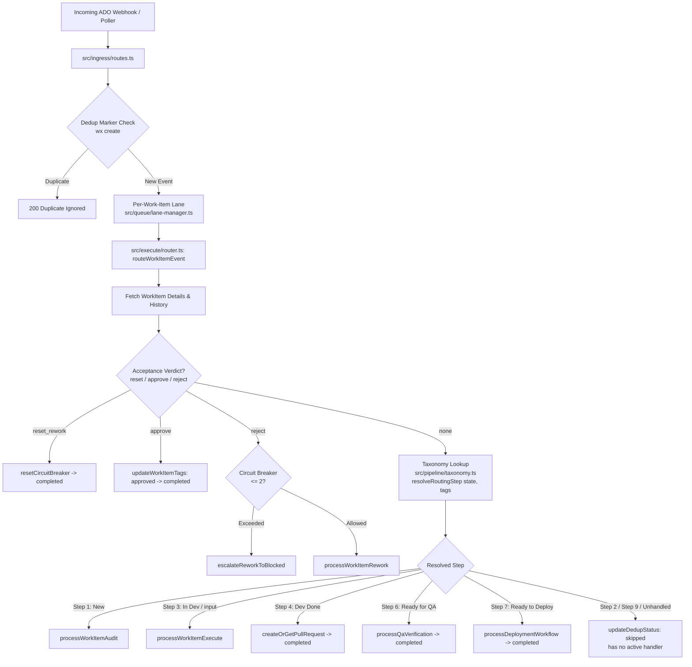

# Phase 2: Taxonomy Foundation - Research

**Researched:** 2026-09-17  
**Domain:** Pipeline taxonomy, state-transition routing, lifecycle replay testing  
**Confidence:** HIGH  

<user_constraints>
## User Constraints (from CONTEXT.md)

### Locked Decisions
- None explicit in CONTEXT.md; all implementation choices at Claude's discretion.

### Claude's Discretion
- `src/pipeline/taxonomy.ts` defines `GOLDEN_PATH_V2` as a frozen, type-safe data structure mapping each of the 9 steps to column, step number, name, actor ('AI' | 'Human'), evidence level ('L1'..'L7'), and primary ADO state.
- Zero runtime dependencies for `src/pipeline/taxonomy.ts` (pure TypeScript).
- Router in `src/execute/router.ts` integrates with taxonomy without altering wire contract (ADO states and tags unchanged).
- Replay parity test asserting full `New` -> `Ready to Dev` -> `In Dev` -> `Dev Done` -> `Ready for QA` -> `Ready to Deploy` -> `Done` routing behavior.

### Deferred Ideas (OUT OF SCOPE)
- None.
</user_constraints>

<phase_requirements>
## Phase Requirements

| ID | Description | Research Support |
|----|-------------|------------------|
| TAX-01 | System models the Golden Path v2 as a single data-driven source (`src/pipeline/taxonomy.ts`): each of the 9 steps mapped to its column (Refinement/Execution/Acceptance/Release/Retro), actor (⚡ AI / 👤 Human), evidence level (L1–L7), and ADO state — with no v1.0 directory renames (taxonomy is additive metadata over the existing src dirs). | Frozen `GOLDEN_PATH_V2` data structure, TypeScript types, and lookup helpers established in `src/pipeline/taxonomy.ts` with zero external dependencies. |
| TAX-03 | Taxonomy adoption is behavior-preserving for v1.0 routing — a mapping test asserts all 9 steps resolve column/actor/evidence-level/ADO-state from the taxonomy source, and a v1-lifecycle replay test drives fixture revisions `New → … → Done` asserting identical handler dispatch to v1.0. | `src/execute/router.ts` refactored to look up step configurations from `taxonomy.ts`; verified via `tests/taxonomy.test.ts` (mapping assertions) and `tests/lifecycle-replay.test.ts` (full lifecycle replay). |
</phase_requirements>

## Summary

Phase 2 builds single data-driven taxonomy foundation for Golden Path v2 (5 columns / 9 steps / actors ⚡👤 / L1–L7 evidence) in `src/pipeline/taxonomy.ts`. Pure TypeScript module with zero runtime dependencies.

Router (`src/execute/router.ts`) connects to taxonomy lookup without altering ADO wire contract or tag strings. Acceptance verdicts (`approve`, `reject`, `reset_rework`) continue running first. State transitions map through taxonomy step resolution. Replay test (`tests/lifecycle-replay.test.ts`) drives fixture work item through `New` -> `Ready to Dev` -> `In Dev` -> `Dev Done` -> `Ready for QA` -> `Ready to Deploy` -> `Done`, asserting exact v1.0 parity.

**Primary recommendation:** Model `GOLDEN_PATH_V2` as deeply frozen array of step descriptors in `src/pipeline/taxonomy.ts`; refactor `src/execute/router.ts` to dispatch via `resolveRoutingStep(workItem.state, workItem.tags)`. Keep all existing handler calls, parameter passthroughs, and skip messages identical.

## Architectural Responsibility Map

| Capability | Primary Tier | Secondary Tier | Rationale |
|------------|-------------|----------------|-----------|
| Golden Path v2 Data Model | API / Backend (Domain Model) | — | Pure TypeScript constants and lookup functions in `src/pipeline/taxonomy.ts`; zero I/O or state. |
| State-Transition Routing | API / Backend (Router) | Database / Storage (`StateStore`) | `src/execute/router.ts` evaluates acceptance verdicts, looks up taxonomy step, delegates to worker, records dedup state. |
| Step Mapping Verification | Test / CI Harness | — | Unit assertions in `tests/taxonomy.test.ts` proving all 9 steps resolve column, actor, evidence level, and ADO state. |
| Lifecycle Replay Parity | Test / CI Harness | API / Backend (Workers) | Integration test in `tests/lifecycle-replay.test.ts` proving full v1.0 behavior preservation across all states. |

## Standard Stack

### Core
| Library | Version | Purpose | Why Standard |
|---------|---------|---------|--------------|
| `node:fs` / `node:path` | native Node.js 24 | File operations in test harnesses | Built into runtime. Zero external dependencies. [VERIFIED: node v24.0.2] |
| `typescript` | `^5.6.x` | Static typing & frozen const structures | Strict compile-time checks on step numbers, column names, actors, and evidence levels. [VERIFIED: package.json] |
| `vitest` | `^5.0.0` | Test runner for taxonomy and replay suite | Existing suite runner. Executes in <2s per file. [VERIFIED: npm test] |

### Supporting
| Library | Version | Purpose | When to Use |
|---------|---------|---------|-------------|
| `fastify` | `^5.2.1` | Webhook gateway | Incoming ADO events routing to `routeWorkItemEvent`. [VERIFIED: package.json] |
| `azure-devops-node-api` | `^14.1.0` | ADO client types | Typings for work item patch operations in replay tests. [VERIFIED: package.json] |

### Alternatives Considered
| Instead of | Could Use | Tradeoff |
|------------|-----------|----------|
| Pure TS array / objects | Zod runtime schema | Unnecessary overhead. Taxonomy is compile-time fixed metadata with zero dynamic parsing requirements. YAGNI. |
| `src/pipeline/taxonomy.ts` | Renaming `src/` dirs to match columns | Massive file churn across 36 test files and 16 dirs with zero functional benefit. Constraint forbids directory renames. |

## Architecture Patterns

### System Architecture Diagram



### Recommended Project Structure
```
src/
├── pipeline/
│   └── taxonomy.ts           # [NEW] Golden Path v2 canonical taxonomy definition & lookups
├── execute/
│   ├── router.ts             # [REFACTOR] State switch delegates to taxonomy resolution
│   ├── worker.ts             # Execution worker (Step 3)
│   └── rework-worker.ts      # Rework worker
├── auditor/                  # Audit worker (Step 1)
├── qa/                       # QA worker (Step 6)
├── deploy/                   # Deploy worker (Step 7/8)
└── state/                    # File-backed StateStore
tests/
├── taxonomy.test.ts          # [NEW] TAX-01 & TAX-03 taxonomy mapping assertions
└── lifecycle-replay.test.ts  # [NEW] TAX-03 full v1.0 lifecycle replay parity test
```

### Pattern 1: Frozen Taxonomy Data Model (`GOLDEN_PATH_V2`)
**What:** Frozen TypeScript data structure defining 5 columns, 9 steps, actors, evidence levels, and ADO states.  
**When to use:** Everywhere lifecycle stages, evidence dimensions, or routing states are queried.  
**Example:**
```typescript
// Source: src/pipeline/taxonomy.ts
export type ColumnId =
  | 'REFINEMENT'
  | 'EXECUTION'
  | 'ACCEPTANCE'
  | 'RELEASE'
  | 'RETRO';

export type StepNumber = 1 | 2 | 3 | 4 | 5 | 6 | 7 | 8 | 9;
export type ActorRole = 'AI' | 'Human';
export type EvidenceLevel = 'L1' | 'L2' | 'L3' | 'L4' | 'L5' | 'L6' | 'L7';
export type AdoState =
  | 'New'
  | 'Ready to Dev'
  | 'In Dev'
  | 'Dev Done'
  | 'Ready for QA'
  | 'Ready to Deploy'
  | 'Done';

export interface StepDefinition {
  readonly step: StepNumber;
  readonly name: string;
  readonly column: ColumnId;
  readonly actor: ActorRole;
  readonly actorDetail: string;
  readonly evidenceLevels: readonly EvidenceLevel[];
  readonly primaryEvidenceLevel: EvidenceLevel;
  readonly adoState: AdoState;
  readonly gateType: 'human_verdict' | 'automated_trigger';
  readonly keyTags?: readonly string[];
  readonly description?: string;
}

export const GOLDEN_PATH_V2: readonly StepDefinition[] = Object.freeze([
  Object.freeze({
    step: 1,
    name: 'Ticket & AC verify',
    column: 'REFINEMENT',
    actor: 'AI',
    actorDetail: 'AI Agent',
    evidenceLevels: ['L1'],
    primaryEvidenceLevel: 'L1',
    adoState: 'New',
    gateType: 'automated_trigger',
    keyTags: ['[audit-passed]', '[awaiting-scope-lock]'],
  }),
  Object.freeze({
    step: 2,
    name: 'Scope review & verify',
    column: 'REFINEMENT',
    actor: 'Human',
    actorDetail: 'Human PM',
    evidenceLevels: ['L1'],
    primaryEvidenceLevel: 'L1',
    adoState: 'Ready to Dev',
    gateType: 'human_verdict',
    keyTags: ['[awaiting-scope-lock]', '[scope-locked]'],
  }),
  Object.freeze({
    step: 3,
    name: 'Loop: Plan-Code-Test',
    column: 'EXECUTION',
    actor: 'AI',
    actorDetail: 'AI Agent',
    evidenceLevels: ['L2', 'L3'],
    primaryEvidenceLevel: 'L3',
    adoState: 'In Dev',
    gateType: 'automated_trigger',
    keyTags: ['[awaiting-input]'],
  }),
  Object.freeze({
    step: 4,
    name: 'Dev validate & PR',
    column: 'EXECUTION',
    actor: 'Human',
    actorDetail: 'Human Dev',
    evidenceLevels: ['L2', 'L3'],
    primaryEvidenceLevel: 'L2',
    adoState: 'Dev Done',
    gateType: 'human_verdict',
    keyTags: ['[awaiting-acceptance]', '[acceptance-approved]'],
  }),
  Object.freeze({
    step: 5,
    name: 'PR review & CI deploy',
    column: 'ACCEPTANCE',
    actor: 'Human',
    actorDetail: 'Human TechLead/SA',
    evidenceLevels: ['L3', 'L4'],
    primaryEvidenceLevel: 'L4',
    adoState: 'Dev Done',
    gateType: 'human_verdict',
    keyTags: ['[pr-merged]'],
  }),
  Object.freeze({
    step: 6,
    name: 'QA staging verify',
    column: 'ACCEPTANCE',
    actor: 'Human',
    actorDetail: 'Human QA',
    evidenceLevels: ['L3', 'L5'],
    primaryEvidenceLevel: 'L5',
    adoState: 'Ready for QA',
    gateType: 'human_verdict',
    keyTags: ['[qa-verified]', '[qa-failed]'],
  }),
  Object.freeze({
    step: 7,
    name: 'Release approval + deploy',
    column: 'RELEASE',
    actor: 'Human',
    actorDetail: 'Human QA/SA/Lead/PM',
    evidenceLevels: ['L5'],
    primaryEvidenceLevel: 'L5',
    adoState: 'Ready to Deploy',
    gateType: 'human_verdict',
    keyTags: ['[deploying]'],
  }),
  Object.freeze({
    step: 8,
    name: 'Smoke test & monitor',
    column: 'RELEASE',
    actor: 'AI',
    actorDetail: 'AI / Automation',
    evidenceLevels: ['L6'],
    primaryEvidenceLevel: 'L6',
    adoState: 'Ready to Deploy',
    gateType: 'automated_trigger',
    keyTags: ['[deploy-regressed]', '[smoke-harness-error]'],
  }),
  Object.freeze({
    step: 9,
    name: 'Retro takeaways, docs, skill enhancement',
    column: 'RETRO',
    actor: 'AI',
    actorDetail: 'AI Agent & Team',
    evidenceLevels: ['L7'],
    primaryEvidenceLevel: 'L7',
    adoState: 'Done',
    gateType: 'automated_trigger',
    keyTags: ['[golden-path-complete]', '[retro-failed]'],
  }),
]);
```

### Pattern 2: Taxonomy Lookup and Router Integration
**What:** Router calls `resolveRoutingStep(workItem.state, workItem.tags)` and uses step identity.  
**When to use:** In `src/execute/router.ts`.  
**Example:**
```typescript
// Pure lookup helper in src/pipeline/taxonomy.ts
export function resolveRoutingStep(
  state: string,
  tags?: string[] | null
): StepDefinition | undefined {
  if (tags && tags.includes('[awaiting-input]')) {
    return GOLDEN_PATH_V2.find((s) => s.step === 3);
  }
  switch (state) {
    case 'New':
      return GOLDEN_PATH_V2.find((s) => s.step === 1);
    case 'Ready to Dev':
      return GOLDEN_PATH_V2.find((s) => s.step === 2);
    case 'In Dev':
      return GOLDEN_PATH_V2.find((s) => s.step === 3);
    case 'Dev Done':
      return GOLDEN_PATH_V2.find((s) => s.step === 4);
    case 'Ready for QA':
      return GOLDEN_PATH_V2.find((s) => s.step === 6);
    case 'Ready to Deploy':
      return GOLDEN_PATH_V2.find((s) => s.step === 7);
    case 'Done':
      return GOLDEN_PATH_V2.find((s) => s.step === 9);
    default:
      return undefined;
  }
}
```

### Anti-Patterns to Avoid
- **Directory renames:** Do not rename `src/auditor`, `src/execute`, `src/qa`, etc., into `src/refinement`, `src/acceptance`. Explicit constraint against this.
- **Leaking v2 terminology to ADO states:** Do not change ADO wire state strings (e.g. do not invent an ADO state named `Refinement` or `Release`). ADO Boards uses `New`, `Ready to Dev`, `In Dev`, `Dev Done`, `Ready for QA`, `Ready to Deploy`, `Done`.
- **Breaking acceptance verdict precedence:** Do not put state switch before `detectAcceptanceVerdict`. Human verdicts on `Dev Done` / `Blocked` must evaluate before state routing.
- **Adding runtime dependencies to `taxonomy.ts`:** Do not import `stateStore`, `adoClient`, `env`, or `zod` into `taxonomy.ts`. Must remain pure TS data.

## Don't Hand-Roll

| Problem | Don't Build | Use Instead | Why |
|---------|-------------|-------------|-----|
| Immutability | Custom freeze proxies or deep clone libraries | `Object.freeze` on literals | Native JS runtime feature. Zero dependencies. |
| Wire protocol | Custom ADO state mappings or string transformations | Exact string literals (`AdoState`) | ADO REST API rejects non-existent state names. |
| Test Harness | Separate test runner | Vitest (`createTestStateStore`, mock ADO client) | Existing 312 tests use established harness; zero friction. |

## Common Pitfalls

### Pitfall 1: Breaking Router Options Passthrough
**What goes wrong:** `routeWorkItemEvent(workItemId, revId, options)` drops `options` when delegating to handlers.  
**Why it happens:** Refactoring handler calls to a table or switch without forwarding `options`.  
**How to avoid:** Ensure `options` is forwarded to `processWorkItemExecute(workItemId, revId, options)`, `processQaVerification(workItemId, options)`, `processDeploymentWorkflow(workItemId, revId, options)`.  
**Warning signs:** `rework-integration.test.ts`, `deploy-orchestrator.test.ts`, or `qa-orchestrator.test.ts` fail due to missing `mockRunner` or `mockMetrics`.

### Pitfall 2: Altering the Dedup Skip Status Message
**What goes wrong:** Router changes message from `Ticket state '${workItem.state}' has no active handler` to something else.  
**Why it happens:** Attempting to make error message "cleaner" or referencing v2 step names.  
**How to avoid:** Preserve exact template literal: ``Ticket state '${workItem.state}' has no active handler``.  
**Warning signs:** Existing tests checking dedup skip messages fail.

### Pitfall 3: Incomplete Lifecycle Replay Testing
**What goes wrong:** Replay test only tests 2 or 3 states instead of the full 7-state lifecycle.  
**Why it happens:** Shortcutting setup of mock data for downstream stages like QA and Deploy.  
**How to avoid:** Build fixture sequence exercising all transitions: `New` (Step 1) -> `Ready to Dev` (Step 2 skip) -> `In Dev` (Step 3) -> `Dev Done` (Step 4 PR) -> `[approve-acceptance]` -> `Ready for QA` (Step 6) -> `Ready to Deploy` (Step 7/8) -> `Done` (Step 9 skip).

## Code Examples

### Step Lookups in `src/pipeline/taxonomy.ts`
```typescript
// Source: src/pipeline/taxonomy.ts
export function getStepByNumber(step: StepNumber): StepDefinition | undefined {
  return GOLDEN_PATH_V2.find((s) => s.step === step);
}

export function getStepsByColumn(column: ColumnId): readonly StepDefinition[] {
  return GOLDEN_PATH_V2.filter((s) => s.column === column);
}

export function getStepsByAdoState(state: string): readonly StepDefinition[] {
  return GOLDEN_PATH_V2.filter((s) => s.adoState === state);
}
```

### Refactored Router Switch in `src/execute/router.ts`
```typescript
// Source: src/execute/router.ts
const step = resolveRoutingStep(workItem.state, workItem.tags);

if (!step) {
  stateStore.updateDedupStatus(
    workItemId,
    revId,
    'skipped',
    `Ticket state '${workItem.state}' has no active handler`
  );
  return;
}

switch (step.step) {
  case 1: // Step 1: Ticket & AC verify
    await processWorkItemAudit(workItemId, revId);
    break;
  case 3: // Step 3: Loop: Plan-Code-Test
    await processWorkItemExecute(workItemId, revId, options);
    break;
  case 4: // Step 4: Dev validate & PR
    await handleDevDonePrCreation(workItemId, revId, workItem);
    break;
  case 6: // Step 6: QA staging verify
    await processQaVerification(workItemId, options);
    stateStore.updateDedupStatus(workItemId, revId, 'completed');
    break;
  case 7: // Step 7/8: Release approval + deploy / Smoke test & monitor
    await processDeploymentWorkflow(workItemId, revId, options);
    stateStore.updateDedupStatus(workItemId, revId, 'completed');
    break;
  default:
    stateStore.updateDedupStatus(
      workItemId,
      revId,
      'skipped',
      `Ticket state '${workItem.state}' has no active handler`
    );
    break;
}
```

## State of the Art

| Old Approach (v1.0) | Current Approach (v2.0 Phase 2) | When Changed | Impact |
|---------------------|---------------------------------|--------------|--------|
| Implicit 8 stages hardcoded in comments and disjoint files | Explicit 5 columns / 9 steps / L1–L7 data model in `src/pipeline/taxonomy.ts` | Phase 2 | Unified source of truth for all pipeline stages. |
| Hardcoded `if (workItem.state === '...')` ladder in `router.ts` | Step-driven switch using `resolveRoutingStep` | Phase 2 | Allows clean integration of future gates (PM Scope Lock in Phase 3, Smoke in Phase 5). |

## Assumptions Log

| # | Claim | Section | Risk if Wrong |
|---|-------|---------|---------------|
| A1 | In v1.0, `Ready to Dev` and `Done` states have no active webhook handler and record `skipped` status in dedup store. | Summary / Pitfalls | None. Verified in `src/execute/router.ts:155` and tested in existing test files. |
| A2 | Step 2 primary ADO state is `Ready to Dev` (target of Refinement approval). | Architecture Patterns | Low. Clarified in State Matrix: Refinement begins at `New` (Step 1) and exits to `Ready to Dev` (Step 2). |

## Open Questions

None. Scope and interfaces are fully constrained by CONTEXT.md and Authoritative State Matrix.

## Environment Availability

Step 2.6: SKIPPED (Pure TypeScript code and unit/integration tests; uses existing Node.js 24 and Vitest environment).

## Validation Architecture

### Test Framework
| Property | Value |
|----------|-------|
| Framework | Vitest 5.0.0 |
| Config file | `vitest.config.ts` |
| Quick run command | `npx vitest run tests/taxonomy.test.ts` |
| Full suite command | `npm test` |

### Phase Requirements → Test Map
| Req ID | Behavior | Test Type | Automated Command | File Exists? |
|--------|----------|-----------|-------------------|-------------|
| TAX-01 | Model 5 columns, 9 steps, actors, evidence levels, ADO states in `GOLDEN_PATH_V2` with zero runtime dependencies | unit | `npx vitest run tests/taxonomy.test.ts` | ❌ Wave 0 Gap |
| TAX-03 | Taxonomy resolution assertions + v1 lifecycle replay parity (`New` -> `Ready to Dev` -> `In Dev` -> `Dev Done` -> `Ready for QA` -> `Ready to Deploy` -> `Done`) | unit / integration | `npx vitest run tests/taxonomy.test.ts tests/lifecycle-replay.test.ts` | ❌ Wave 0 Gap |

### Sampling Rate
- **Per task commit:** `npx vitest run tests/taxonomy.test.ts tests/lifecycle-replay.test.ts`
- **Per wave merge:** `npm test`
- **Phase gate:** Full suite green (all 312+ tests) before phase completion.

### Wave 0 Gaps
- [ ] `src/pipeline/taxonomy.ts` — taxonomy definition module
- [ ] `tests/taxonomy.test.ts` — covers TAX-01 & TAX-03 taxonomy resolution assertions
- [ ] `tests/lifecycle-replay.test.ts` — covers TAX-03 full lifecycle replay test

## Security Domain

### Applicable ASVS Categories

| ASVS Category | Applies | Standard Control |
|---------------|---------|-----------------|
| V2 Authentication | no | Internal pipeline orchestration; HMAC validated at ingress boundary. |
| V3 Session Management | no | Stateless webhook processing. |
| V4 Access Control | no | Handled by ADO branch policies and environment approvals. |
| V5 Input Validation | yes | TypeScript compile-time union checking + fallback on unknown ADO states in router. |
| V6 Cryptography | no | No cryptography introduced in taxonomy module. |

### Known Threat Patterns for Stack

| Pattern | STRIDE | Standard Mitigation |
|---------|--------|---------------------|
| State Confusion / Desynchronization | Tampering | Exact ADO state matching; unexpected states mark dedup as `skipped` without state corruption. |
| Prototype Mutation | Tampering | `Object.freeze` deeply applied to `GOLDEN_PATH_V2` and all step definitions. |

## Sources

### Primary (HIGH confidence)
- `.idea/v2.md` — Golden Path v2 specification (5 columns, 9 steps, actor roles, evidence L1–L7).
- `.planning/ROADMAP.md` — Authoritative ADO State Matrix lines 33–44.
- `src/execute/router.ts` — Existing v1.0 router implementation.
- `tests/worker.test.ts`, `tests/rework-integration.test.ts`, `tests/deploy-orchestrator.test.ts`, `tests/qa-orchestrator.test.ts` — Existing worker and router integration test patterns.

## Metadata

**Confidence breakdown:**
- Standard stack: HIGH — Zero new dependencies; pure TypeScript and native Node.js.
- Architecture: HIGH — Direct mapping of `.idea/v2.md` and Authoritative State Matrix into code.
- Pitfalls: HIGH — Router options passthrough and dedup skip strings verified from existing codebase.

**Research date:** 2026-09-17  
**Valid until:** Indefinite (internal architecture contract)
