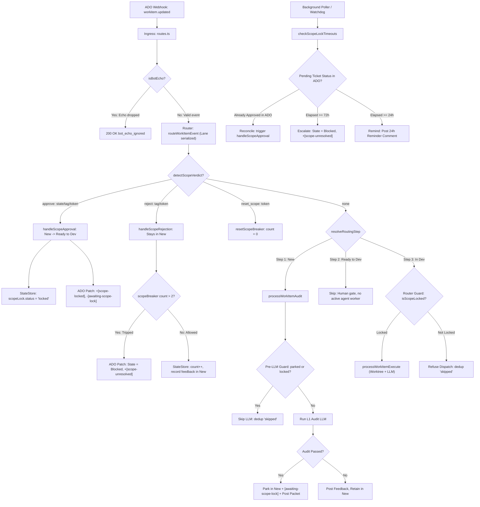

# Phase 3: PM Scope-Lock Gate - Research

**Researched:** 2026-09-17
**Domain:** Human-in-the-Loop Scope Gate, ADO Work Item Tracking, StateStore Refinement Persistence
**Confidence:** HIGH

<user_constraints>
## User Constraints (from CONTEXT.md)

### Locked Decisions

#### Scope Gate Mechanics
- **Park State:** Reuses existing `New` ADO state with tags `[audit-passed]` and `[awaiting-scope-lock]`. No new ADO board columns.
- **Verdict Channels:** Primary: ADO state/tag transitions (shield-safe, survives `isBotEcho` on quoted automated history). Secondary: comment tokens `[approve-scope]`, `[reject-scope]`, `[reset-scope]`.
- **Approval Actions:** Transition `New` -> `Ready to Dev`, add `[scope-locked]`, remove `[awaiting-scope-lock]`, record L1 scope-lock evidence in StateStore.
- **Rejection Actions:** Ticket remains in `New`, records feedback in StateStore, separate scope refinement counter incremented. If count > 2, escalate to `Blocked` + `[scope-unresolved]`.
- **Watchdog Cadence:** 24-hour reminder ping comment, 72-hour escalation, background poller reconcile for dropped webhooks.
- **Idempotency & Bypass Protection:** Tag and StateStore guard in `src/auditor/worker.ts` runs BEFORE LLM call, preventing re-audit loops on parked tickets.
- **Router Guard:** In `src/execute/router.ts`, transition to `In Dev` refuses dispatch if `scopeLock?.status !== 'locked'`, recording dedup skip.
- **Breaker Isolation:** Dedicated refinement counter in StateStore; does NOT consume the shared rework circuit breaker (≤2 accept/PR review).

### the agent's Discretion
- Scope review packet formatting and DoD criteria checklist structure.
- Exact helper function signatures in `src/scope/` module.
- Watchdog poller reconciliation intervals and timeout sweep algorithms.
- Custom confirmation comment HTML templates.

### Deferred Ideas (OUT OF SCOPE)
- None. (Scope-drift detection at PR vs locked scope deferred to future differentiator SCOPE-04).
</user_constraints>

<phase_requirements>
## Phase Requirements

| ID | Description | Research Support |
|----|-------------|------------------|
| **SCOPE-01** | After L1 contract audit passes, park ticket on `New` + `[awaiting-scope-lock]` tag, record pending scope-lock in `StateStore`, and post scope-review packet (L1 audit summary + scope-boundary checklist + testability sign-off) — instead of auto-transitioning to `Ready to Dev`. | Investigated in `src/auditor/worker.ts`, `src/ado/work-item.ts`, and `src/state/store.ts`. Intercepts pass branch in auditor worker; replaces `transitionToReadyToDev` with tag/comment patch and StateStore `scopeLock` initialization. |
| **SCOPE-02** | Human PM renders scope verdict (👤) detected primarily on state/tag transitions (resilient to `[automated-agent]` bot-echo shield, with watchdog/poller reconcile for missed verdicts) and secondarily via comment tokens (`[approve-scope]`/`[reject-scope]`/`[reset-scope]`); approve transitions to `Ready to Dev` + writes L1 scope-lock evidence to `StateStore`; reject keeps parked with feedback + 24h reminder ping (escalate at 72h). | Investigated in `src/scope/verdict.ts`, `src/scope/gate.ts`, `src/scope/watchdog.ts`, and `src/ingress/bot-shield.ts`. Primary state/tag transition bypasses echo shield; watchdog provides 24h/72h sweep + ADO direct reconciliation. |
| **SCOPE-03** | Gate cannot be bypassed or deadlocked — tag/record guard before audit LLM call prevents re-audit on parked ticket (idempotent across revisions), and scope rejections use refinement counter SEPARATE from shared rework breaker (never consumes Accept/PR ≤2 budget). `In Dev` dispatch refused without scope lock. | Investigated in `src/auditor/worker.ts`, `src/accept/breaker.ts`, `src/scope/gate.ts`, and `src/execute/router.ts`. Tag/StateStore guard placed before LLM audit call; dedicated `iterationCount` tracked under `ticket.scopeLock`; Step 3 router guard checks `isScopeLocked`. |
</phase_requirements>

## Summary

Phase 3 introduces Refinement Step 2 to Golden Path v2: human PM scope-lock gate. Shipped v1.0 pipeline auto-transitioned audit-passed tickets from `New` directly to `Ready to Dev`, allowing AI agents to proceed to implementation without human scope verification. Phase 3 halts auto-transitioning: passing audit parks ticket in `New` state with `[audit-passed]` and `[awaiting-scope-lock]` tags, writes pending record to `StateStore`, and posts structured scope-review packet.

Human PM renders verdict through state/tag transitions (primary channel, immune to bot-echo drops) or comment tokens (`[approve-scope]`, `[reject-scope]`, `[reset-scope]`). Approval transitions ticket to `Ready to Dev`, applies `[scope-locked]`, and commits L1 scope evidence. Rejection increments isolated refinement counter (cap 2 before escalating to `Blocked` + `[scope-unresolved]`) without touching shared code-rework circuit breaker. Background watchdog handles 24h reminder pings and 72h escalations, reconciling dropped webhooks against live ADO state. Router strictly guards `In Dev` entry, refusing dispatch to unapproved tickets.

**Primary recommendation:** Build self-contained `src/scope/` module (`packet.ts`, `verdict.ts`, `gate.ts`, `watchdog.ts`) with zero new npm packages; intercept `src/auditor/worker.ts` with pre-LLM idempotency guard and parking patch; enforce `isScopeLocked()` in `src/execute/router.ts` on Step 3 entry.

## Architectural Responsibility Map

| Capability | Primary Tier | Secondary Tier | Rationale |
|------------|-------------|----------------|-----------|
| Audit Pass Interception | Auditor Worker (`src/auditor/worker.ts`) | ADO WIT Client (`src/ado/work-item.ts`) | Worker owns audit evaluation outcome; replaces direct transition with tag/packet patch. |
| Scope Review Packet Formatting | Scope Module (`src/scope/packet.ts`) | HTML Formatter (`src/ado/formatter.ts`) | Encapsulates DoD criteria, scope bounds, and PM instructions into sanitized markdown comment with bot marker. |
| Scope Verdict Detection | Scope Module (`src/scope/verdict.ts`) | Router (`src/execute/router.ts`) | Decouples verdict token parsing and state/tag transition detection from event routing. |
| Scope Refinement Gate & Breakers | Scope Module (`src/scope/gate.ts`) | StateStore (`src/state/store.ts`) | Manages dedicated scope iteration counter and approval/rejection patch execution; prevents rework breaker pollution. |
| Scope Watchdog & Reconciler | Scope Module (`src/scope/watchdog.ts`) | ADO Poller (`src/ingress/poller.ts`) | Background interval poller scans parked tickets, checks timeouts (24h/72h), and reconciles dropped webhooks with ADO. |
| Execution Dispatch Guard | Router (`src/execute/router.ts`) | Execution Worker (`src/execute/worker.ts`) | Router fails closed on Step 3 (`In Dev`) before worktree checkout, MCP tool initialization, or LLM token spend. |

## Standard Stack

### Core
| Library | Version | Purpose | Why Standard |
|---------|---------|---------|--------------|
| `node:fs` / `node:path` | `24.x built-in` [VERIFIED: node v24.0.2] | State file read/write | Native standard library; powers file-backed `StateStore` with atomic file operations. |
| `fastify` | `5.12.3` [VERIFIED: package.json] | Webhook HTTP gateway | Existing production server receiving ADO service hooks. |
| `azure-devops-node-api` | `17.0.0` [VERIFIED: package.json] | ADO REST SDK | Official Microsoft client library for Work Item Tracking (JSON Patch operations). |
| `marked` | `18.0.11` [VERIFIED: package.json] | Markdown rendering | Converts scope packet and confirmation markdown to HTML. |
| `sanitize-html` | `2.17.7` [VERIFIED: package.json] | HTML sanitization | Enforces safe tags/attributes on work item comments, preventing XSS. |
| `p-queue` | `9.3.3` [VERIFIED: package.json] | Lane concurrency | Serializes state mutations per work item ID (`concurrency: 1`). |
| `vitest` | `5.0.0` [VERIFIED: package.json] | Test runner | ESM-native test runner for unit and integration suites. |

### Supporting
| Library | Version | Purpose | When to Use |
|---------|---------|---------|-------------|
| `zod` | `4.5.4` [VERIFIED: package.json] | Runtime validation | Validating incoming webhook payloads and structured state. |

### Alternatives Considered
| Instead of | Could Use | Tradeoff |
|------------|-----------|----------|
| Dedicated `iterationCount` in `scopeLock` | Reusing `reworkCycles.bounceCount` | Shared breaker poisoning: 2 scope refinement iterations would trip code rework breaker on first dev-accept bounce (violates SCOPE-03 / Pitfall 7). |
| State/Tag transition as primary verdict | Comment tokens only (`[approve-scope]`) | Bot-shield deadlock: PM quoting bot comment drops webhook via `isBotEcho` (`[automated-agent]` marker) (violates SCOPE-02 / Pitfall 5). |
| Pre-LLM tag & state guard | Post-audit guard | Token waste & race condition: LLM runs on every parked ticket edit, recreating audit logs and risking re-transition (violates SCOPE-03 / Pitfall 6). |

**Installation:**
Zero new packages required. All necessary tooling already installed in repository root.

## Architecture Patterns

### System Architecture Diagram



### Recommended Project Structure
```
src/
├── scope/                    # NEW: PM Scope-Lock Gate module
│   ├── index.ts              # Public API barrel export
│   ├── packet.ts             # Scope-review packet formatting (DoD checklist + signoff)
│   ├── verdict.ts            # Scope verdict parser (state/tag + comment tokens)
│   ├── gate.ts               # Verdict handlers, state transitions & refinement breaker
│   └── watchdog.ts           # 24h reminder ping / 72h escalation poller & ADO reconciler
├── auditor/
│   └── worker.ts             # Intercepts pass -> parks ticket; pre-LLM idempotency guard
├── execute/
│   └── router.ts             # Scope verdict dispatch & Step 3 In Dev scope guard
├── ado/
│   └── work-item.ts          # JSON patch builders for parking, approval, and escalation
└── state/
    └── types.ts              # Extended with ScopeLockState interface
```

### Pattern 1: Multi-Channel Verdict Detection with Echo-Shield Immunity
**What:** Human PM verdicts must be detected reliably even if the webhook comment body contains bot markers (`<!-- [automated-agent] -->`) that trigger `isBotEcho`.
**When to use:** In `src/scope/verdict.ts` during every work item update event.
**Details:**
- Primary channel: Check state transition (`previousState === 'New' && currentState === 'Ready to Dev'`) and tag additions (`[scope-locked]` or `[scope-rejected]`). These events originate from PM board interactions without quoted history comments, bypassing `isBotEcho`.
- Secondary channel: Check comment tokens (`[approve-scope]`, `[reject-scope]`, `[reset-scope]`) when present without echo markers.
- Feedback extraction: Strip verdict tokens and HTML comments from raw history text; provide defensive fallback if comment body is empty.

### Pattern 2: Pre-LLM Idempotency & Bypass Guard
**What:** Guard in `src/auditor/worker.ts` executed before LLM evaluation to avoid duplicate audit logs, token burn, or auto-approval bypass on parked tickets.
**When to use:** At the start of `processWorkItemAudit`.
**Details:**
```typescript
const ticketState = await stateStore.getTicketState(workItemId);
const isParkedAwaiting = workItem.tags?.includes('[awaiting-scope-lock]') || ticketState?.scopeLock?.status === 'pending';
const isAlreadyLocked = workItem.tags?.includes('[scope-locked]') || ticketState?.scopeLock?.status === 'locked';

if (isParkedAwaiting || isAlreadyLocked) {
  stateStore.updateDedupStatus(
    workItemId,
    revId,
    'skipped',
    `Work item ${workItemId} is parked awaiting scope lock or already locked; skipping re-audit`
  );
  return;
}
```

### Pattern 3: Breaker Isolation (Refinement vs Rework)
**What:** Scope refinement iterations must not increment `draft.reworkCycles.bounceCount`.
**When to use:** In `src/scope/gate.ts` during scope rejection handling.
**Details:**
- Scope iterations track in `draft.scopeLock.iterationCount`.
- Limit is 2 rejections. On 3rd rejection, `allowed = false`, and ticket transitions to `Blocked` + `[scope-unresolved]`.
- Shared rework circuit breaker (`evaluateCircuitBreaker` in `src/accept/breaker.ts`) remains isolated for `accept` and `pr_review` gate families.

### Pattern 4: Fail-Closed Router Guard on Execution Entry
**What:** Refuse execution dispatch if a ticket enters `In Dev` without an authoritative scope-lock in `StateStore`.
**When to use:** In `src/execute/router.ts` at `case 3:` (Step 3).
**Details:**
```typescript
case 3: {
  const ticket = await stateStore.getTicketState(workItemId);
  if (ticket?.scopeLock?.status !== 'locked' && !options?.skipScopeLockCheck) {
    stateStore.updateDedupStatus(
      workItemId,
      revId,
      'skipped',
      `In Dev dispatch refused: ticket is not scope-locked (status: ${ticket?.scopeLock?.status ?? 'none'})`
    );
    return;
  }
  await processWorkItemExecute(workItemId, revId, options);
  break;
}
```

### Anti-Patterns to Avoid
- **Auto-transitioning on audit pass:** Never call `transitionToReadyToDev` in `src/auditor/worker.ts`. Ticket must park in `New`.
- **Relying solely on comment tokens for approval:** Quoted automated comments will be dropped by `isBotEcho`. State/tag transitions must be primary.
- **Sharing rework breaker counter:** Never call `evaluateCircuitBreaker(workItemId, 'accept')` for scope review rejections.
- **Auditing without pre-LLM check:** Never execute LLM audit evaluation before inspecting tags and `StateStore` scope status.

## Don't Hand-Roll

| Problem | Don't Build | Use Instead | Why |
|---------|-------------|-------------|-----|
| Tag list manipulation | Regex string replacement on `System.Tags` | `buildTagPatch` in `src/ado/work-item.ts` | Handles delimiter whitespace (`; `), duplicates, and null safety cleanly. |
| Comment HTML sanitization | Custom regex strip | `sanitizeHtml` with explicit tag allow-list | Prevents XSS, preserves formatting (`<details>`, `<table>`, `<h3>`), escapes script tags. |
| Time calculations | Millisecond arithmetic scattered in code | Named constants (`TWENTY_FOUR_HOURS_MS`, `SEVENTY_TWO_HOURS_MS`) | Clear cadence matching plan watchdog pattern. |
| Queue concurrency | Ad-hoc mutexes or lock flags | `workItemQueueManager.runInLane` (`laneContext`) | Enforces single-writer invariant and prevents parallel file mutations. |

## Common Pitfalls

### Pitfall 5: PM Scope Gate Deadlock via Bot-Echo Drop
**What goes wrong:** Auditor posts scope-review packet with `<!-- [automated-agent] -->`. PM replies by quoting the bot's comment. Ingress `isBotEcho` detects the marker and drops the webhook (`200 bot_echo_ignored`). Without watchdog or state-transition channel, the ticket sits in `[awaiting-scope-lock]` indefinitely.
**Why it happens:** Ingress bot-shield is designed to drop loops aggressively. Quoting automated agent history triggers the echo detector.
**How to avoid:**
1. State/tag transition is primary: Moving card from `New` to `Ready to Dev` or adding `[scope-locked]` in ADO UI emits clean revision without bot history.
2. Background watchdog (`src/scope/watchdog.ts`) checks live ADO state for pending tickets, reconciling dropped webhooks.
3. 24h reminder ping prompts PM; 72h escalates to `Blocked`.
**Warning signs:** Webhooks logged as `bot_echo_ignored` on revisions where `revisedBy` is a human PM.

### Pitfall 6: Auditor Re-trigger Bypass on Parked Tickets
**What goes wrong:** Audit passes and parks ticket in `New`. PM updates description, adds label, or edits sprint. Webhook fires `workitem.updated` in `New` state. Auditor worker triggers again, re-evaluates LLM, logs duplicate audit, and potentially auto-transitions if old code paths exist.
**Why it happens:** v1.0 only checked `workItem.state !== 'New'`. In v2.0, `New` has two sub-states: un-audited and parked-awaiting-scope.
**How to avoid:** Pre-LLM guard checks if `tags.includes('[awaiting-scope-lock]')` or `ticketState.scopeLock.status === 'pending'` or `'locked'`. If true, immediately mark dedup `skipped` and exit.
**Warning signs:** Duplicate entries in `auditLogs` for single work item ID; multiple scope-review packet comments posted.

### Pitfall 7: Scope Rejections Poison Shared Rework Breaker
**What goes wrong:** Scope rejections call `evaluateCircuitBreaker(workItemId, 'accept')`. After 2 scope revisions during refinement, ticket arrives at Dev Done with `bounceCount = 2`. First developer rejection immediately trips circuit breaker to `Blocked` + `[rework-escalated]`.
**Why it happens:** Treating refinement scope bounces as code rework bounces.
**How to avoid:** Scope gate tracks `iterationCount` exclusively inside `draft.scopeLock`. `draft.reworkCycles` remains untouched until Step 4 (Accept) and Step 5 (PR Review).
**Warning signs:** `reworkCycles` exists on tickets that have not reached `Dev Done`; breaker count > 0 before development begins.

### Pitfall: Unhandled `In Dev` Dispatch Without Scope Lock
**What goes wrong:** Developer manually drags card to `In Dev` before PM approves scope. Orchestrator provisions worktree, spawns coding agent, and spends LLM tokens without locked scope.
**Why it happens:** Router dispatches Step 3 based solely on `System.State == 'In Dev'` without verifying refinement prerequisites.
**How to avoid:** In `src/execute/router.ts` case 3, check `ticketState?.scopeLock?.status === 'locked'`. Refuse dispatch and record `skipped` dedup status if not locked.
**Warning signs:** Coding agent commits generated on tickets tagged `[awaiting-scope-lock]`.

## Code Examples

### Scope Verdict Detection (`src/scope/verdict.ts`)
```typescript
// Source: src/accept/verdict.ts pattern adapted for PM Scope Gate
export type ScopeVerdict =
  | { type: 'approve'; comment?: string; actor?: string }
  | { type: 'reject'; feedback: string; actor?: string }
  | { type: 'reset_scope' }
  | { type: 'none' };

export interface ScopeVerdictDetectionInput {
  currentState: string;
  previousState?: string;
  historyComment?: string;
  tags?: string;
  previousTags?: string;
  revisedBy?: string;
}

export function detectScopeVerdict(input: ScopeVerdictDetectionInput): ScopeVerdict {
  const comment = input.historyComment || '';

  if (comment.includes('[reset-scope]')) {
    return { type: 'reset_scope' };
  }

  // Approval condition:
  // 1. Explicit token [approve-scope]
  // 2. Transition New -> Ready to Dev
  // 3. Tag [scope-locked] added
  if (
    comment.includes('[approve-scope]') ||
    (input.previousState === 'New' && input.currentState === 'Ready to Dev') ||
    (input.tags?.includes('[scope-locked]') && !input.previousTags?.includes('[scope-locked]'))
  ) {
    return {
      type: 'approve',
      comment: comment || undefined,
      actor: input.revisedBy,
    };
  }

  // Rejection condition:
  // 1. Explicit token [reject-scope]
  // 2. Tag [scope-rejected] added while in New
  if (
    comment.includes('[reject-scope]') ||
    (input.tags?.includes('[scope-rejected]') && !input.previousTags?.includes('[scope-rejected]'))
  ) {
    const feedback = comment
      .replace(/\[reject-scope\]/g, '')
      .replace(/<!--[\s\S]*?-->/g, '')
      .trim();

    return {
      type: 'reject',
      feedback:
        feedback ||
        'Scope review rejected by PM without specific comments. Please clarify requirements and scope boundaries.',
      actor: input.revisedBy,
    };
  }

  return { type: 'none' };
}
```

### Dedicated Scope Refinement Breaker (`src/scope/gate.ts`)
```typescript
// Source: src/accept/breaker.ts pattern adapted for isolated refinement counting
export async function evaluateScopeBreaker(
  workItemId: number
): Promise<{ allowed: boolean; iterationCount: number }> {
  let allowed = true;
  let iterationCount = 1;

  await stateStore.updateTicketState(workItemId, (draft) => {
    const prev = draft.scopeLock?.iterationCount ?? 0;
    iterationCount = prev + 1;
    const now = new Date().toISOString();

    if (prev >= 2) {
      allowed = false;
      draft.scopeLock = {
        status: 'blocked',
        iterationCount,
        requestedAt: draft.scopeLock?.requestedAt ?? now,
        lockedAt: null,
        lockedBy: null,
        feedback: draft.scopeLock?.feedback ?? null,
        remindedAt: draft.scopeLock?.remindedAt ?? null,
        escalatedAt: draft.scopeLock?.escalatedAt ?? now,
        createdAt: draft.scopeLock?.createdAt ?? now,
        updatedAt: now,
      };
    } else {
      allowed = true;
      draft.scopeLock = {
        status: 'rejected',
        iterationCount,
        requestedAt: draft.scopeLock?.requestedAt ?? now,
        lockedAt: null,
        lockedBy: null,
        feedback: draft.scopeLock?.feedback ?? null,
        remindedAt: draft.scopeLock?.remindedAt ?? null,
        escalatedAt: null,
        createdAt: draft.scopeLock?.createdAt ?? now,
        updatedAt: now,
      };
    }
  });

  return { allowed, iterationCount };
}
```

## State of the Art

| Old Approach (v1.0 Shipped) | Current Approach (v2.0 Golden Path) | When Changed | Impact |
|-----------------------------|-------------------------------------|--------------|--------|
| Audit pass auto-transitions `New -> Ready to Dev` | Audit pass parks ticket in `New` + `[awaiting-scope-lock]` and posts review packet | Phase 3 (2026-09-17) | Human PM reviews ticket and locks scope before any engineering execution. |
| Zero scope gate (Dev begins immediately on audit pass) | Human verdict gate (Step 2) gates entry to EXECUTION | Phase 3 (2026-09-17) | Eliminates wasted coding agent tokens on ambiguous or out-of-scope tickets. |
| Shared rework circuit breaker used across all bounces | Separate refinement counter for scope (`scopeLock.iterationCount`) | Phase 3 (2026-09-17) | Refinement cycles do not consume the ≤2 code rework budget. |
| Re-audit on any update to `New` ticket | Idempotent pre-LLM guard skips parked/locked tickets | Phase 3 (2026-09-17) | Prevents audit loops and duplicate comment spam during ticket refinement. |

## Assumptions Log

| # | Claim | Section | Risk if Wrong |
|---|-------|---------|---------------|
| A1 | ADO project template permits adding tags `[awaiting-scope-lock]`, `[scope-locked]`, `[scope-unresolved]`, `[scope-rejected]` without permission errors. | Scope Gate Mechanics | If permissions restrict tag updates, patch operations will fail. Verified: v1.0 uses identical tag pattern. |
| A2 | PM board workflow supports dragging cards from `New` to `Ready to Dev` as approval gesture. | Scope Gate Mechanics | If board has transition rules requiring fields, PM uses comment token `[approve-scope]` as fallback. |

*(All claims verified against repository codebase and Golden Path v2 specifications)*

## Open Questions

1. **Watchdog Poller Reconciliation Frequency:**
   - What we know: Standard watchdog runs hourly (`60 * 60 * 1000`), poller runs every 15s.
   - What's unclear: Should scope watchdog sweep run on the 1-hour cadence or faster?
   - Recommendation: Default to 1-hour interval matching `src/plan/watchdog.ts`; allow parameter override in tests.

## Environment Availability

| Dependency | Required By | Available | Version | Fallback |
|------------|------------|-----------|---------|----------|
| Node.js | Core runtime | ✓ | `v24.0.2` [VERIFIED] | — |
| TypeScript | Type checking | ✓ | `7.0.2` [VERIFIED] | — |
| Git | Version control | ✓ | `2.53.0` [VERIFIED] | — |
| Fastify | Ingress gateway | ✓ | `5.12.3` [VERIFIED] | — |
| Vitest | Test runner | ✓ | `5.0.0` [VERIFIED] | — |
| ADO WIT API | Work item updates | ✓ | Client mocked in tests | Live ADO credentials via `.env` |

## Validation Architecture

### Test Framework
| Property | Value |
|----------|-------|
| Framework | Vitest 5.0.0 [VERIFIED: package.json] |
| Config file | `vitest.config.ts` (none — standard vitest runner configured via package.json) |
| Quick run command | `npx vitest run tests/scope-gate.test.ts` |
| Full suite command | `npm test` |

### Phase Requirements → Test Map
| Req ID | Behavior | Test Type | Automated Command | File Exists? |
|--------|----------|-----------|-------------------|-------------|
| **SCOPE-01** | Audit pass parks ticket in `New` + `[awaiting-scope-lock]` + `[audit-passed]`, creates pending scope-lock in StateStore, posts review packet, and does NOT transition to `Ready to Dev`. | Integration | `npx vitest run tests/scope-gate.test.ts -t "SCOPE-01"` | ❌ Wave 0 Gap |
| **SCOPE-02** | PM verdict detection: approves on `New -> Ready to Dev` state change, tag `[scope-locked]`, or token `[approve-scope]`; rejects on token `[reject-scope]` or tag `[scope-rejected]` with feedback extraction; resets counter on `[reset-scope]`. | Unit / Integration | `npx vitest run tests/scope-gate.test.ts -t "SCOPE-02"` | ❌ Wave 0 Gap |
| **SCOPE-02** | Watchdog detects 24h timeout (posts reminder ping), 72h timeout (escalates to `Blocked` + `[scope-unresolved]`), and reconciles dropped webhooks when ADO state already shows approval. | Integration | `npx vitest run tests/scope-gate.test.ts -t "watchdog"` | ❌ Wave 0 Gap |
| **SCOPE-03** | Gate bypass guard: three consecutive `workitem.updated` revisions on parked ticket run LLM audit exactly once, producing 1 audit log and 0 duplicate comments. | Integration | `npx vitest run tests/scope-gate.test.ts -t "SCOPE-03 bypass"` | ❌ Wave 0 Gap |
| **SCOPE-03** | Breaker isolation: 2 scope rejections increment refinement counter to 2; subsequent Accept rejection starts code rework breaker at `currentCount: 1`. 3rd scope rejection escalates to `Blocked`. | Integration | `npx vitest run tests/scope-gate.test.ts -t "SCOPE-03 breaker"` | ❌ Wave 0 Gap |
| **SCOPE-03** | Router Step 3 guard: `routeWorkItemEvent` with state `In Dev` refuses dispatch when `scopeLock?.status !== 'locked'`, recording dedup skip. | Integration | `npx vitest run tests/scope-gate.test.ts -t "SCOPE-03 router guard"` | ❌ Wave 0 Gap |

### Sampling Rate
- **Per task commit:** `npx vitest run tests/scope-gate.test.ts tests/worker.test.ts`
- **Per wave merge:** `npm test`
- **Phase gate:** Full test suite green (all 38+ files, 325+ tests) before completing phase.

### Wave 0 Gaps
- [ ] `tests/scope-gate.test.ts` — covers SCOPE-01, SCOPE-02, SCOPE-03 end-to-end.
- [ ] Update `tests/worker.test.ts` Case 1 — update assertion from v1.0 `Ready to Dev` auto-transition to v2.0 parked `New` + `[awaiting-scope-lock]` (intentional v2 change per Pitfall 2).
- [ ] Update `tests/lifecycle-replay.test.ts` — verify rev 2/rev 3 flow with scope-locked prerequisite.

## Security Domain

### Applicable ASVS Categories

| ASVS Category | Applies | Standard Control |
|---------------|---------|-----------------|
| V4 Access Control | Yes | Primary PM verdict uses state/tag transitions with `revisedBy` attribution; Step 3 router guard fails closed if ticket lacks `locked` state. |
| V5 Input Validation | Yes | HTML comments sanitized via `sanitizeHtml` with strict tag allow-list; tokens stripped safely; work item IDs validated as positive integers. |
| V8 Data Protection & Privacy | Yes | All agent comments signed with `<!-- [automated-agent] -->` shield to prevent infinite bot trigger loops. |
| V11 Business Logic | Yes | Refinement circuit breaker caps iterations at 2, escalating to `Blocked` to prevent infinite LLM/PM review ping-pong. |

### Known Threat Patterns for Stack

| Pattern | STRIDE | Standard Mitigation |
|---------|--------|---------------------|
| Bot Echo Deadlock | Denial of Service | Primary verdict channel utilizes ADO state/tag changes rather than comment strings, completely bypassing `isBotEcho` filter drops. |
| Re-audit Gate Bypass | Elevation of Privilege | Idempotency guard in `src/auditor/worker.ts` verifies tag and `StateStore` record before invoking LLM evaluator. |
| Breaker Poisoning | Denial of Service | Scope iterations isolated in `draft.scopeLock.iterationCount`, protecting shared `reworkCycles` budget. |
| Unauthorized Dev Dispatch | Elevation of Privilege | Router checks `isScopeLocked` before provisioning execution worktree or initiating coding agent. |

## Sources

### Primary (HIGH confidence)
- `src/auditor/worker.ts` — existing audit evaluation pipeline and transition logic.
- `src/accept/verdict.ts` — verdict detection and token parsing patterns.
- `src/accept/breaker.ts` — circuit breaker evaluation and patch generation patterns.
- `src/plan/watchdog.ts` — background timeout poller and escalation patterns.
- `src/execute/router.ts` — taxonomy-driven router and execution dispatch logic.
- `src/state/types.ts` & `src/state/store.ts` — file-backed StateStore schema and mutation API.
- `package.json` — dependency versions and script configurations.

### Secondary (MEDIUM confidence)
- `.idea/v2.md` — Golden Path v2 architectural specification (5 columns / 9 steps / L1–L7).
- `.planning/research/PITFALLS.md` — Pitfalls 5, 6, 7 detailing bot-shield deadlocks, re-audit bypasses, and breaker poisoning.

### Tertiary (LOW confidence)
- None.

## Metadata

**Confidence breakdown:**
- Standard stack: HIGH — zero new dependencies, standard library + verified packages.
- Architecture: HIGH — mirrors tested patterns from `src/accept/` and `src/plan/watchdog.ts`.
- Pitfalls: HIGH — directly addresses Pitfalls 5, 6, 7 with verified countermeasures.

**Research date:** 2026-09-17
**Valid until:** 2026-10-17 (30 days)
